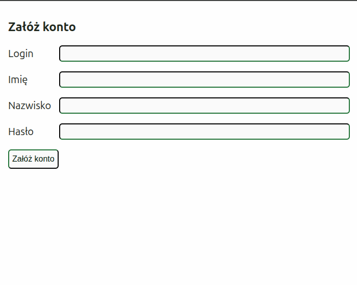
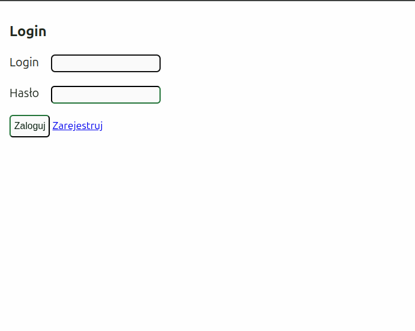
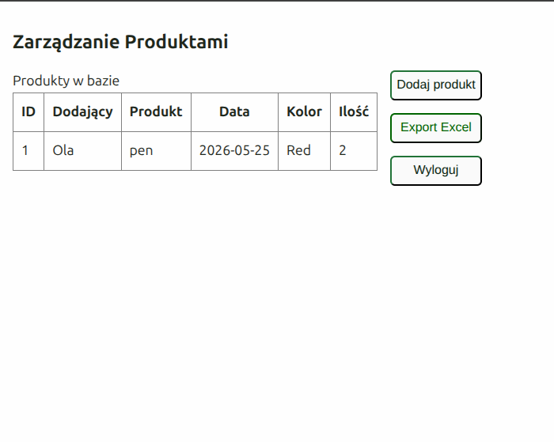

# Description

This is a simple project to manage products in the database. It's for a Polish-speaking users.

## It allows users to

### Create an account:



### Log in:



### View added products:



### Add pencils:

 and amount.")

### Add pens:

, color (with black selected) and amount.")

---

# Setup Guide

This project uses Docker for local development and deployment.

---

## Start the Application

Build and start all containers:

```bash
docker compose up --build
```

---

## Common Docker Port Conflict

If you see an error similar to:

```text
bind for 0.0.0.0:5432 failed: port is already allocated
```

Open the `docker-compose.yaml` file and find the container mentioned in the error.

Example:

```yaml
db:
    container_name: symfony_db
    ports:
        - "5433:5432"
```

Change the exposed port to another available one:

```yaml
db:
    container_name: symfony_db
    ports:
        - "5434:5432"
```

---

## Restart the Containers

After updating the configuration, stop the current containers:

```bash
docker compose down
```

Then rebuild and start the application again:

```bash
docker compose up --build
```

---

## Check Application Logs

The setup downloads symfony dependencies and migrates data, so check whether it's ready:

```bash
docker compose logs -f web-app
```

Wait until the following message appears:

```text
symfony_app Running database migrations...
symfony_app [OK] Successfully migrated to version: DoctrineMigrations ...
```

---

## 🌐 Access the Application

Once the setup is complete, open:

```text
http://localhost:8080
```

---

## Troubleshooting

### Rebuild Without Cache

```bash
docker compose build --no-cache
```

### List Running Containers

```bash
docker ps
```

### Stop All Containers

```bash
docker compose down
```
